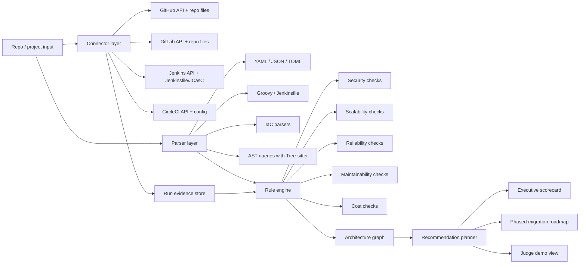
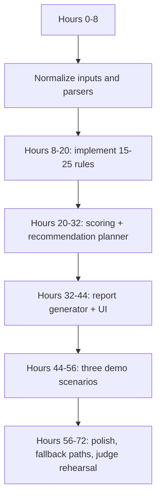

# CI/CD Architecture Auditor

Prepared from the perspective of a software delivery architect focused on CI/CD modernization, platform engineering, and software supply-chain security.

## Executive summary

A “CI/CD Architecture Auditor” is a strong hackathon concept because the raw ingredients already exist across the mainstream delivery stack: repository-native pipeline definitions, provider APIs for recent runs and jobs, runner telemetry, reusable pipeline abstractions, and policy/scanning tools. In practical terms, estates built around entity["company","GitHub","developer platform"], entity["company","GitLab","devsecops platform"], entity["company","CircleCI","ci cd platform"], and legacy environments centered on the Jenkins project can already be inspected through config files plus platform APIs, while policy engines and scanners can evaluate YAML, IaC, Dockerfiles, and code without requiring language-specific build execution. citeturn31view0turn31view1turn31view2turn31view3turn21view2turn23view2turn27view0turn29view0turn29view1turn29view2turn29view3turn30view1

The problem is also highly judge-friendly. It is concrete, painful, and easy to demonstrate: duplicated pipelines, long-lived secrets, deploy bottlenecks, brittle self-hosted runners, controller overload, ungoverned third-party actions/orbs/plugins, and poor observability. That maps directly to established frameworks from entity["organization","NIST","us standards body"], entity["organization","OWASP","application security foundation"], and entity["organization","OpenSSF","open source security foundation"]: SSDF emphasizes secure software development practices, SLSA focuses on progressively stronger supply-chain integrity guarantees, OpenSSF Scorecard offers automated security checks, and the OWASP Top 10 CI/CD Security Risks gives a ready-made taxonomy for attack surfaces such as credential hygiene, flow control, poisoned pipeline execution, and artifact integrity. citeturn19view0turn19view1turn19view2turn19view3

From a hackathon perspective, the best version is not “an autonomous platform engineer” but “an evidence engine plus migration planner.” In 48–72 hours, a credible MVP can ingest repository configs and a small slice of recent pipeline metadata, detect a curated set of high-value anti-patterns, score the estate across security, scalability, reliability, maintainability, and cost, then generate a migration path toward reusable workflows/components, stronger deployment controls, ephemeral runners, and better provenance. That scope is both feasible and demoable. citeturn20view0turn20view1turn21view1turn21view3turn22view1turn23view0turn23view3turn25view2turn27view3turn28view3

The concept also has real expansion potential after the hackathon. The MVP can be static-plus-recent-runs analysis; the enhanced version can add multi-repo topology discovery, rule tuning, and dashboarding; the research/prototype version can add graph reasoning, organization-wide standardization proposals, and LLM-assisted scenario planning. That staged path makes the project look serious to both judges and teammates: an immediate demo today, a platform product tomorrow. citeturn20view2turn22view1turn35view0turn28view3

## Feasibility and hackathon-winning potential

The concept is feasible because the underlying CI systems already expose the primitives the auditor needs. GitHub Actions has workflow/job/run APIs, metrics for run time, queue time, and failure rates, reusable workflows, concurrency groups, OIDC-based authentication, artifact attestations, environment protection rules, and autoscaling approaches for self-hosted runners through Actions Runner Controller. GitLab exposes YAML-defined pipelines, DAG execution with `needs`, parent-child and multi-project pipelines, CI/CD components, runner autoscaling, protected variables and protected environments, analytics, and APIs for pipelines, jobs, runners, and artifacts. Jenkins exposes Pipeline-as-Code through `Jenkinsfile`, Shared Libraries, JCasC, a REST-like Remote Access API, and scaling guidance built around agents rather than controller execution. CircleCI exposes dynamic config, contexts with restrictions, config policies based on OPA, self-hosted runners, parallelism/test splitting, Insights metrics, and API/CLI surfaces. citeturn31view0turn21view2turn22view0turn21view0turn21view1turn34view0turn21view3turn23view0turn23view1turn23view2turn23view3turn24view1turn24view2turn35view0turn31view1turn25view0turn25view1turn25view3turn31view2turn25view2turn26view0turn27view0turn27view1turn27view2turn27view3turn28view2turn28view3turn31view3turn33search0

It is also strategically well aligned with what modern delivery organizations actually need. DORA’s research argues that delivery performance is best understood through throughput and instability metrics, and that continuous delivery practices improve throughput, availability, quality, and even burnout outcomes. The auditor can therefore position itself not only as a security checker, but as a system that links technical delivery design choices to measurable delivery outcomes. That story is much stronger for judges than “we lint YAML.” citeturn20view0turn20view1turn20view2

The strongest hackathon angle is that the product gives judges a before/after decision surface. Instead of merely saying “your pipeline is messy,” it can say “here are twelve concrete findings, here is the evidence, here is the target architecture, here is the sequence of changes, and here is the projected effect on queue time, failure rate, security posture, and operational burden.” That makes the demo feel like applied intelligence rather than static analysis alone. The evidence model is defensible because it can be grounded in SSDF, SLSA, OpenSSF Scorecard, and OWASP CI/CD risks. citeturn19view0turn19view1turn19view2turn19view3

A realistic judge-facing assessment is below.

| Dimension | Why this concept scores well | Why it can lose | How to turn it into a stronger entry |
|---|---|---|---|
| Practical value | Every engineering org accumulates CI/CD drift, duplication, and security debt | If the demo feels like another rules linter | Show migration planning, not just findings |
| Technical ambition | Combines parsing, APIs, policy evaluation, and architecture recommendations | If the stack is too broad and shallow | Scope the MVP to 15–25 high-value checks |
| Demo clarity | Easy to show a messy setup and a target-state blueprint | If the report is too long or vague | Use one-page executive scorecard plus drill-down evidence |
| Novelty | “Architecture auditor + prioritized migration path” is differentiated from plain scanners | If the LLM pitch dominates and trust drops | Make LLM optional and clearly bounded by evidence |
| Expansion potential | Can grow into platform governance, repo onboarding, and compliance support | If roadmap sounds disconnected from MVP | Reuse the same evidence graph and policy engine |

My overall assessment: **high feasibility**, **high hackathon-winning potential**, **especially strong if positioned as an expert copilot for CI/CD modernization rather than a generic security chatbot**. The likely sweet spot is “MVP + one striking live migration plan + one measurable before/after story.” citeturn19view3turn20view0turn22view1turn35view0turn28view3

## Product variants and prioritized feature sets

The variants below are intentionally staged so the hackathon build is convincingly complete, while leaving substantial room for a post-hackathon roadmap.

| Variant | User promise | Scope boundary | Best fit |
|---|---|---|---|
| **MVP** | Upload or connect a repo, inspect CI/CD configs plus recent run metadata, receive a scored report and migration plan | Static config + a lightweight recent-run snapshot; no autonomous remediation | 48–72 hour hackathon |
| **Enhanced** | Correlate multiple repos/tools, compare current vs target architecture, track improvement over time | Cross-repo topology, analytics, richer policy bundles, issue export | Early product validation |
| **Research / prototype** | Build an organizational delivery graph and simulate alternative standardization paths | Graph reasoning, benchmark models, what-if analysis, constrained LLM planning | Post-hackathon technical differentiation |

### Recommended priorities by variant

| Variant | Priority | Features |
|---|---|---|
| **MVP** | P0 | Parse GitHub/GitLab/Jenkins/CircleCI configs; ingest last N pipeline runs/jobs from APIs where available; detect 15–25 anti-patterns; produce evidence-backed scorecard; generate phased migration path; support three demo scenarios |
|  | P1 | SARIF/JSON export; downloadable report; per-finding evidence links; simple web UI; confidence labels |
|  | P2 | Limited natural-language Q&A over findings |
| **Enhanced** | P0 | Multi-repo/project ingestion; reusable-pattern detection across org; runner capacity analysis; “golden pipeline” target templates; dashboard with trends |
|  | P1 | Policy packs mapped to SSDF/SLSA/OWASP; change impact simulation; ticket creation for backlog items |
|  | P2 | Comparative benchmarking across teams/business units |
| **Research / prototype** | P0 | Delivery graph across repos, runners, secrets, environments, and artifacts; policy reasoning over transitive delivery dependencies |
|  | P1 | LLM-assisted synthesis of architecture options with evidence citations and cost/risk trade-off explanations |
|  | P2 | Auto-generated migration PR drafts for reusable workflows/components/shared libraries/JCasC |

The MVP must focus on findings that feel architectural, not merely stylistic. The most valuable checks are the ones that materially alter security or delivery performance: long-lived cloud credentials where OIDC/federation is available, deployment jobs without environment protections, duplicate deploy logic that should be centralized into reusable workflows/components/shared libraries/orbs, controller execution in Jenkins rather than agents, uncontrolled self-hosted runner fleets, stage-based bottlenecks where DAG or dynamic config would help, cache/artifact misuse, and lack of provenance/attestations. Those are all grounded in provider capabilities documented today. citeturn21view0turn34view3turn34view0turn21view2turn23view2turn25view1turn33search0turn26view0turn25view2turn23view0turn27view0turn28view0turn21view1

A useful rule of thumb for prioritization is this: **if a finding does not change the migration plan, it should not be in the MVP**. That keeps the hackathon system opinionated and judge-friendly.

## Reference architecture and evidence model

The reference architecture below is the most suitable balance of speed and rigor for a hackathon build. It combines repository parsing, provider API sampling, rule-based scoring, and report synthesis. The architecture is justified by the fact that all four major CI platforms expose machine-readable APIs/configuration and that policy/scanning tools such as OPA/Conftest, Semgrep, Checkov, and Tree-sitter are already designed to reason over structured config, code, and IaC. citeturn31view0turn31view1turn31view2turn31view3turn29view0turn29view1turn29view2turn29view3turn30view1turn27view2



The evidence model should be explicit and inspectable. Each finding should contain: source artifact, relevant line/path/API object, framework mapping, severity, confidence, current-state impact, target-state recommendation, and migration dependency. That structure mirrors how SSDF, SLSA, and OWASP frame control objectives and how DORA frames operational outcomes. citeturn19view0turn19view1turn19view3turn20view0

### Evidence sources and checks the agent should produce

| Dimension | Evidence sources | Typical checks | Why it matters |
|---|---|---|---|
| **Security** | Pipeline configs, secret references, environment protections, OIDC settings, attestation settings, protected vars/envs, rule/policy configs. citeturn21view0turn21view1turn34view0turn24view1turn24view2turn27view1turn27view2 | Long-lived cloud secrets instead of OIDC; deploys without reviewers or branch restrictions; unrestricted contexts/variables; missing provenance/attestations; third-party action/orb/plugin sprawl; signs of controller execution in Jenkins. citeturn34view3turn34view0turn21view1turn27view1turn26view2turn26view0 | Maps directly to SSDF, SLSA, and OWASP CI/CD risks such as credential hygiene, PBAC, poisoned pipeline execution, and artifact integrity. citeturn19view0turn19view1turn19view3 |
| **Scalability** | Runner topology, queue metrics, DAG structure, downstream/child pipelines, parallelism, dynamic config, self-hosted runner settings. citeturn22view1turn23view0turn23view1turn23view3turn21view3turn27view0turn27view3turn28view2 | Serial stage bottlenecks; no DAG/`needs`; no parallel matrix/test splitting; non-ephemeral self-hosted runners; controller-heavy Jenkins; fixed runner fleets despite bursty load. citeturn23view0turn24view3turn28view2turn21view3turn25view2turn27view3 | Faster, more elastic delivery means less queueing, better throughput, and lower operations burden. citeturn20view0turn20view1turn22view1turn35view0turn28view3 |
| **Reliability** | Failure rates, MTTR/time-to-recovery, run histories, flaky-job patterns, deploy gating, dependency grouping. citeturn22view1turn35view0turn28view3turn34view0 | No deploy approval path; no concurrency guard on shared targets; high-failure or high-P95 jobs; broad workflows triggered on every change; graph structure that hides critical dependencies. citeturn22view0turn34view0turn22view1turn35view0turn35view1 | DORA treats delivery performance as throughput plus instability; reliability is not a side issue. citeturn20view0turn20view1turn20view2 |
| **Maintainability** | Reusable workflows/components/orbs/shared libraries/JCasC presence, duplication metrics, plugin inventory. citeturn21view2turn23view2turn25view1turn25view3turn33search0turn26view2 | Copy-pasted deployment logic; giant monolithic YAML/Groovy; UI-only Jenkins config without JCasC; unversioned shared patterns; excessive plugin surface. citeturn21view2turn23view2turn25view1turn25view3turn26view2 | Standardization is the quickest way to make migration plans believable and repeatable. |
| **Cost** | Minutes/credits usage, queue times, cache/artifact retention, duplicate job runs, rerun behavior, runner type. citeturn22view1turn22view3turn28view0turn28view1turn28view3 | Cache thrash; oversized retention; always-on self-hosted fleets; reruns that repeat passed work; wide triggers that run unnecessary jobs. citeturn22view3turn28view0turn28view1turn14search6turn27view0 | Cost is visible and judge-friendly when tied to concrete waste patterns, not generic cloud talk. |

A good scoring model for the MVP is a weighted score such as **Security 30 / Reliability 25 / Maintainability 20 / Scalability 15 / Cost 10**, with each rule contributing severity-weighted deductions plus positive credit for modern controls such as OIDC, protected environments, reusable pipeline units, and provenance. That weighting reflects the reality that a safer architecture is usually what unlocks sustainable scale, not the other way around. citeturn19view0turn19view1turn19view3turn20view1

## Delivery plan and roadmap

The hackathon delivery plan should be deliberately narrow: one backend, one rule engine, one report format, three excellent demos. The mistake to avoid is building “all connectors, all checks, all UIs.” The providers already make it possible to ship a smaller but convincing system because static configs and a narrow slice of recent run data already reveal the majority of architectural smells. citeturn31view0turn31view1turn31view2turn31view3turn22view1turn35view0turn28view3



### Hackathon build plan

| Time window | Concrete development steps |
|---|---|
| **Hours 0–8** | Define canonical finding schema; implement repo file ingestion; parse `.github/workflows/*.yml`, `.gitlab-ci.yml`, `Jenkinsfile`, `.circleci/config.yml`; add a thin provider adapter interface |
| **Hours 8–20** | Implement the highest-value rules: long-lived secret detection, deploy gating checks, duplication/reuse checks, DAG/parallelism checks, runner-architecture checks, provenance/attestation checks, metrics sampling |
| **Hours 20–32** | Build evidence graph and severity model; implement target-state templates and phased migration planner |
| **Hours 32–44** | Generate HTML/Markdown report with executive scorecard, findings, migration phases, and diff-like recommendation phrasing |
| **Hours 44–56** | Wire the three demo scenarios; ensure every scenario produces at least one strong architectural recommendation and measurable projected improvement |
| **Hours 56–72** | Add optional LLM summarization behind citations and structured findings; rehearse the live demo; prepare screenshots and fallback prerecorded flow |

### Post-hackathon roadmap

| Phase | Roadmap |
|---|---|
| **First month** | Add authenticated connectors for all four CI systems; expand rules to 40–60 checks; export SARIF/JSON; issue tracker integration; saved assessments |
| **Quarter one** | Cross-repo topology discovery; organization-wide standard templates; suppression workflow; trend dashboard; policy packs mapped to SSDF/SLSA/OWASP |
| **Quarter two** | Delivery graph, what-if simulation, generated migration PRs for reusable workflows/components/shared libraries/JCasC, and compliance reporting |

## Demo scenarios and recommended judge script

The best demo scenarios are synthetic but realistic. They should mirror documented pressure points: GitHub environments, reusable workflows, OIDC, and concurrency; GitLab DAGs, protected variables, protected environments, and child pipelines; Jenkins controller isolation, agents, Shared Libraries, and JCasC; CircleCI dynamic config, restricted contexts, config policies, and test parallelism. citeturn34view0turn21view2turn21view0turn22view0turn23view0turn23view1turn24view1turn24view2turn26view0turn25view1turn25view3turn27view0turn27view1turn27view2turn28view2

### Demo scenarios comparison

| Scenario | Why it is realistic | What the auditor should find first | Best judge angle |
|---|---|---|---|
| **GitHub monorepo with copy-pasted deploys** | Common in growing product orgs that scaled from one service to many | Hard-coded cloud secrets, no concurrency on deploy, duplicated workflow logic, all-path triggers, no attestations | “We turned a YAML jungle into a standard deployment blueprint” |
| **Legacy Jenkins controller doing everything** | Extremely common in older enterprises and internal tooling teams | Builds on controller, credentials too broadly scoped, plugin sprawl, no JCasC, repeated pipeline code | “We can modernize without rewriting every job on day one” |
| **Split GitLab + CircleCI estate** | Realistic for orgs with acquisitions, language silos, or mobile/web split | GitLab stage bottlenecks/protected-var drift; CircleCI unrestricted contexts, no dynamic config, no test splitting | “One auditor can see fragmented delivery systems and unify the migration path” |

### Scenario snippets

These snippets are intentionally short and slightly messy. They are illustrative, not copied from production systems.

#### GitHub monorepo with duplicated deploy logic

This setup is problematic because GitHub supports reusable workflows, OIDC-based cloud auth, deployment protection rules, branch protection, concurrency groups, metrics, and artifact attestations; the messy version ignores most of them. citeturn21view2turn21view0turn34view0turn34view2turn22view0turn22view1turn21view1

```yaml
# .github/workflows/deploy-service-a.yml
name: deploy-service-a
on:
  push:
    branches: [main]
jobs:
  deploy:
    runs-on: ubuntu-latest
    env:
      AWS_ACCESS_KEY_ID: ${{ secrets.AWS_ACCESS_KEY_ID }}
      AWS_SECRET_ACCESS_KEY: ${{ secrets.AWS_SECRET_ACCESS_KEY }}
    steps:
      - uses: actions/checkout@v4
      - run: npm ci && npm test
      - run: ./scripts/deploy-a.sh

# .github/workflows/deploy-service-b.yml
name: deploy-service-b
on:
  push:
    branches: [main]
jobs:
  deploy:
    runs-on: ubuntu-latest
    env:
      AWS_ACCESS_KEY_ID: ${{ secrets.AWS_ACCESS_KEY_ID }}
      AWS_SECRET_ACCESS_KEY: ${{ secrets.AWS_SECRET_ACCESS_KEY }}
    steps:
      - uses: actions/checkout@v4
      - run: pnpm install && pnpm test
      - run: ./scripts/deploy-b.sh
```

What the auditor should say:
- Two near-duplicate deployment workflows should be collapsed into one reusable workflow.
- Long-lived AWS secrets should be replaced with OIDC federation.
- Production deploy jobs should reference a protected environment with required reviewers and branch restrictions.
- A `concurrency` group should protect the production target.
- Release artifacts should emit and verify attestations.

#### Legacy Jenkins controller with UI drift

Jenkins documentation is explicit that long-term controller execution is inadvisable, agents improve safety and scale, Shared Libraries reduce redundancy, JCasC turns UI drift into versioned config, and credentials should be scoped as low as possible. citeturn26view0turn25view2turn25view1turn25view3turn26view1

```groovy
// Jenkinsfile
pipeline {
  agent any
  stages {
    stage('Build') {
      steps {
        sh 'mvn -q clean package'
      }
    }
    stage('Deploy') {
      steps {
        withCredentials([usernamePassword(credentialsId: 'prod-creds',
          usernameVariable: 'USER', passwordVariable: 'PASS')]) {
          sh './deploy-prod.sh'
        }
      }
    }
  }
}
```

```yaml
# jenkins.yaml is missing entirely in the messy setup
# Controller configuration lives only in the UI.
```

What the auditor should say:
- `agent any` is risky when the built-in node still has executors.
- Deployment credentials appear to be controller-scoped and too broad.
- Shared deployment stages should move to a Shared Library.
- Current controller configuration is not reproducible because JCasC is absent.
- Plugin inventory should be reduced and version-governed.

#### Split GitLab backend plus CircleCI mobile release path

GitLab supports DAGs, child pipelines, protected variables, protected environments, analytics, and components; CircleCI supports dynamic config, restricted contexts, config policies, self-hosted runners, caching, and parallelism/test splitting. A fragmented estate that ignores these features is a perfect demo because it shows cross-tool reasoning. citeturn23view0turn23view1turn24view1turn24view2turn35view0turn23view2turn27view0turn27view1turn27view2turn27view3turn28view0turn28view2

```yaml
# .gitlab-ci.yml
stages: [build, test, package, deploy]

build:
  stage: build
  script: ./gradlew build

test:
  stage: test
  script: ./gradlew test

package:
  stage: package
  script: docker build -t registry/app:$CI_COMMIT_SHA .

deploy_prod:
  stage: deploy
  script: ./deploy.sh
  only:
    - main
```

```yaml
# .circleci/config.yml
version: 2.1
jobs:
  mobile_release:
    docker:
      - image: cimg/node:current
    steps:
      - checkout
      - run: yarn install
      - run: yarn test
      - run: ./release-mobile.sh
workflows:
  release:
    jobs:
      - mobile_release:
          context: org-global-prod
```

What the auditor should say:
- GitLab pipeline is purely stage-serial and should use `needs` plus modularized child pipelines/components.
- Production deploy needs protected environments and better variable controls.
- CircleCI deployment uses a global context instead of a restricted one.
- Dynamic config should avoid full mobile release flows on irrelevant changes.
- Test parallelism and better cache strategy should cut mobile feedback time.

### Recommended live demo script for judges

A strong live script is **six to eight minutes**:

1. **Open with the pain**: “Here is a real-looking CI/CD estate with duplicated deploy logic, privileged credentials, and slow, brittle execution.”
2. **Show raw evidence ingestion**: repo files plus a tiny provider metadata sample. Emphasize that the system reads actual pipeline definitions and run data, not screenshots.
3. **Reveal the executive scorecard**: five dimensions, headline score, top three findings, estimated effort buckets.
4. **Drill into one security finding**: for example, long-lived AWS secrets in GitHub; show evidence, cite OIDC-based alternative, and show the target-state recommendation.
5. **Drill into one scalability finding**: for example, a serial GitLab pipeline or Jenkins controller overload; show how DAG/agents/ephemeral runners change the architecture.
6. **Show the phased migration plan**: “Week 1 harden access, Week 2 centralize deployment logic, Week 3 optimize execution model.”
7. **End with before/after narrative**: “The system converts CI/CD entropy into a prioritized modernization backlog with evidence and measurable success criteria.”

The most convincing flourish is a one-click switch between **Current Architecture** and **Recommended Architecture** plus one generated recommendation snippet such as a reusable GitHub workflow or a JCasC stub.

## Tech stack options

The practical recommendation for a hackathon is **Python backend + rule-heavy analysis layer + thin LLM summarizer**, because the differentiator is evidence depth, not framework cleverness.

| Layer | Option | Pros | Cons | Verdict |
|---|---|---|---|---|
| Backend API | **Python + FastAPI** | Fast to prototype; excellent support for parsing, scanners, and data pipelines | Less opinionated structure than some TS stacks | **Best hackathon choice** |
|  | TypeScript + NestJS | Strong typing; good for productizing | More integration friction with Python-centric security tools | Better later if frontend/backend unify |
| Analysis core | **Rule engine + graph model** | Deterministic, auditable, easier to trust in demos | Needs careful rule curation | **Essential** |
|  | LLM-first reasoning | Great summaries | Easy to hallucinate architecture guidance | Only as a synthesis layer |
| Parser layer | **Tree-sitter** | Incremental parsing, language-agnostic AST/query support, official bindings including Python. citeturn30view1turn30view2 | Requires grammar coverage and some AST design | **Strong for Jenkinsfile/Groovy and generalized parsing** |
| Security/code scanning | **Semgrep** | CI-friendly SAST/SCA/secrets platform; broad language support including Terraform, Dockerfile, YAML, and many mainstream languages. citeturn29view2 | Richer platform features may be overkill for MVP | **Use selectively for code/security evidence** |
| IaC scanning | **Checkov** | Built for IaC misconfiguration scanning; supports Terraform, CloudFormation, ARM, Kubernetes, Helm, Docker, SARIF/JUnit outputs, and custom policies. citeturn29view3 | Another dependency to manage | **Excellent for infra findings** |
| Policy engine | **OPA + Rego** | Declarative policy language over hierarchical data; great for explicit policy checks. citeturn29view0 | Learning curve for authoring rules | **Recommended backbone** |
| Config policy helper | **Conftest** | Lightweight config testing built on OPA; natural fit for structured config files. citeturn29view1 | Less useful for broad graph reasoning by itself | **Good for MVP rule execution** |
| CI connectors | Native REST adapters for GitHub/GitLab/Jenkins/CircleCI | Official APIs exist for runs, jobs, artifacts, and metadata. citeturn31view0turn31view1turn31view2turn31view3 | Auth models differ | **Required** |
| UI | **Next.js app** | Best judge-facing polish and report UX | More frontend work | **Best if team has frontend bandwidth** |
|  | Streamlit | Very fast to ship | Harder to make premium-looking | Good fallback |
| Storage | SQLite during hackathon, Postgres later | Minimal ops today; easy upgrade path | Limited concurrency/analytics | **Use SQLite first** |

A good implementation split is:
- **Deterministic core**: parsers, providers, graph, rules, scoring.
- **Recommendation engine**: target-state templates plus migration planner.
- **Optional LLM layer**: turns structured findings into polished prose, but never invents evidence.

That separation is important for trust. Artifact attestations themselves are not a guarantee that software is secure; they provide provenance, which still has to be evaluated against policy. The same design principle should apply to the auditor’s LLM layer: it may explain, but the rule engine decides. citeturn21view1turn29view0turn27view2

## Output report templates, success metrics, and risk management

The report format should look like an architecture review, not a linter dump. The most effective template is:

> **Executive scorecard**  
> Current posture across Security / Scalability / Reliability / Maintainability / Cost  
>  
> **Top architectural findings**  
> Each finding includes evidence, impact, target state, effort, and dependency notes  
>  
> **Migration path**  
> Phase A hardening, Phase B standardization, Phase C scale optimization  
>  
> **Projected outcomes**  
> Queue-time reduction, failure-rate reduction, deploy safety improvements, maintenance simplification  
>  
> **Appendix**  
> Raw evidence pointers, framework mappings, rule versions, confidence notes

### Sample recommendation phrasing

Good recommendation language is explicit, bounded, and implementation-shaped:

- **Replace long-lived cloud secrets with OIDC federation for deployment jobs.**  
  Evidence: GitHub workflow uses repository secrets for AWS credentials.  
  Why now: GitHub supports OIDC for cloud auth; this removes the need to store long-lived cloud credentials in secrets and reduces credential hygiene risk.  
  Target state: deployment workflow assumes a narrowly scoped cloud role via OIDC and branch/environment conditions. citeturn21view0turn34view3turn19view3

- **Move shared deployment logic into a versioned reusable pipeline unit.**  
  Evidence: two or more near-identical deploy workflows/Jenkins stages/CircleCI jobs.  
  Why now: GitHub reusable workflows, GitLab components, Jenkins Shared Libraries, and CircleCI orbs all exist specifically to reduce duplication and standardize execution.  
  Target state: one centrally governed deployment unit reused by all services. citeturn21view2turn23view2turn25view1turn33search0

- **Shift from controller-centric or fixed-runner execution to isolated, elastic workers.**  
  Evidence: Jenkins builds on controller or GitHub/GitLab/CircleCI self-hosted capacity is static and queue-heavy.  
  Why now: vendor guidance favors agents, autoscaling runners, or Kubernetes-based runners for safer and more elastic execution.  
  Target state: controller only orchestrates; ephemeral workers execute jobs. citeturn26view0turn25view2turn21view3turn23view3turn27view3

### Success metrics and judging criteria mapping

Use a mix of product metrics and DORA-aligned delivery metrics. DORA explicitly frames delivery performance in terms of throughput and instability and recommends using multiple metrics rather than one vanity number. citeturn20view0

| Judge criterion | What to show | Product metric |
|---|---|---|
| **Problem significance** | Three obviously messy real-world scenarios | Time to first meaningful finding under 60 seconds |
| **Technical depth** | Parsers + APIs + rule engine + migration planner | At least 15 high-value checks across the five dimensions |
| **Usefulness** | Evidence-backed recommendations, not generic advice | % of findings with concrete target-state action and effort estimate |
| **Innovation** | Cross-tool architecture view, not single-tool linting | One unified report spanning ≥2 CI systems in at least one demo |
| **Demo quality** | Before/after architecture switch, readable executive summary | Judge can understand top 3 recommendations in under 90 seconds |
| **Credibility** | Official-doc-backed mappings to SSDF/SLSA/OWASP/DORA | Every major recommendation linked to evidence and framework rationale |

Recommended product success metrics after the hackathon:
- Median time to assessment for a repo or project.
- Precision of top-10 findings as judged by platform engineers.
- Percentage of findings accepted into the engineering backlog.
- Improvement in median pipeline duration, failure rate, queue time, and unsafe secret usage over subsequent weeks. citeturn22view1turn35view0turn28view3turn20view0

### Risks, limitations, and mitigation

| Risk | Why it matters | Mitigation |
|---|---|---|
| **LLM overreach** | Architectural advice can become untrustworthy fast | Keep a rule-first core and require every narrative recommendation to reference structured evidence |
| **Connector/auth friction** | API auth varies; some orgs will not grant broad access during a hackathon | Support file-upload mode plus optional token-based metadata enrichment |
| **Provider feature skew** | Features differ by platform and plan; e.g., GitHub environment protections and CircleCI config policy details vary by plan/use case | Mark provider-specific recommendations with availability notes and confidence |
| **False positives from synthetic parsing** | CI configs often use anchors, includes, generated configs, and indirection | Show confidence levels; resolve includes where possible; allow “unknown / needs runtime confirmation” |
| **Messy estates exceed MVP scope** | Large orgs may span many repos and custom wrappers | Demo on bounded scenarios and present multi-repo correlation as roadmap |
| **Jenkins complexity** | UI-only config, plugin sprawl, and controller drift make exact analysis harder | Lean on JCasC detection, plugin inventory sampling, and high-value heuristics rather than full environment emulation |

The final strategic recommendation is simple: **build the MVP as a trusted architecture reviewer with a narrow, high-signal rule set; do not try to be a full autonomous DevOps agent yet**. That is the version most likely to win judges, earn teammate confidence, and survive first contact with real CI/CD estates. citeturn19view0turn19view1turn19view3turn20view0turn21view1turn25view2turn27view2